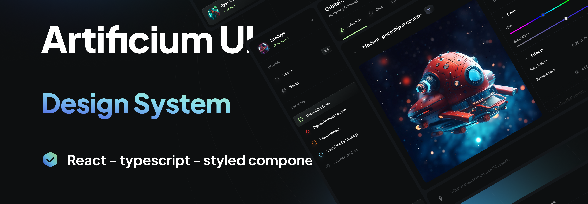

# Artificium UI Library



### Maintainers

[](https://github.com/frex-is)

### ✏️ Description:

Artificium UI Library is a versatile and responsive React component library built with TypeScript. This library is designed to seamlessly integrate into your React projects, providing a collection of reusable UI components inspired by the [Artificium](https://www.figma.com/community/file/1237505388738737733) Figma design who was created by [Mikołaj Niżnik](https://www.figma.com/@mniznik).

### 🖥️ Install and Run the application (Local Development):

Requirements:
- [Node.js v20.10.0 or later](https://nodejs.org/en/download).

1. Clone the repository:

```bash
git clone https://github.com/frex-is/artificium-ui.git
```

2. Install the dependencies:
   
```bash
npm install
```

3. Run the application:
   
```bash
npm run storybook
```

### 🐋 Install and Run the application (Containerized Development):

Requirements:
- [Docker](https://www.docker.com/products/docker-desktop/).
- [visual studio code](https://code.visualstudio.com/download) or [github codespaces](https://github.com/features/codespaces).
  
#### Visual Studio Code:

1. Clone the repository:

```bash
git clone https://github.com/frex-is/artificium-ui.git
```

2. Open the project in Visual Studio Code.

```bash
code artificium-ui
```

3. Install the [Remote - Containers](https://marketplace.visualstudio.com/items?itemName=ms-vscode-remote.remote-containers) extension.

4. Reopen the project in a container.
5. Run the application:

```bash
npm run storybook
```

#### GitHub Codespaces:

1. Open the project in GitHub Codespaces.
2. Run the application:

```bash
npm run storybook
```

### ©️ License

This project is licensed under the [MIT License](https://github.com/frex-is/artificium-ui?tab=MIT-1-ov-file#readme).